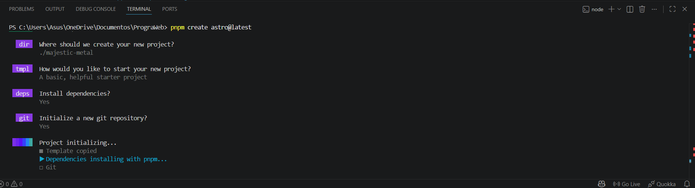
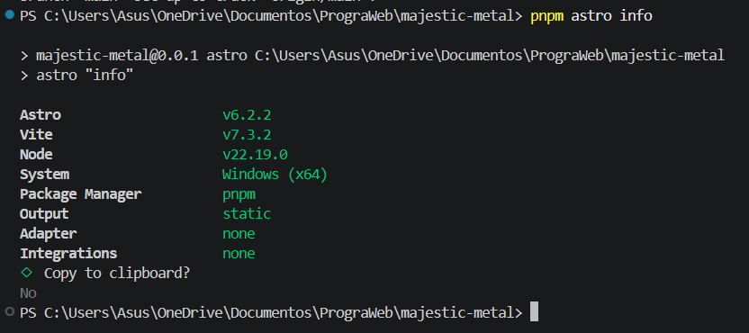
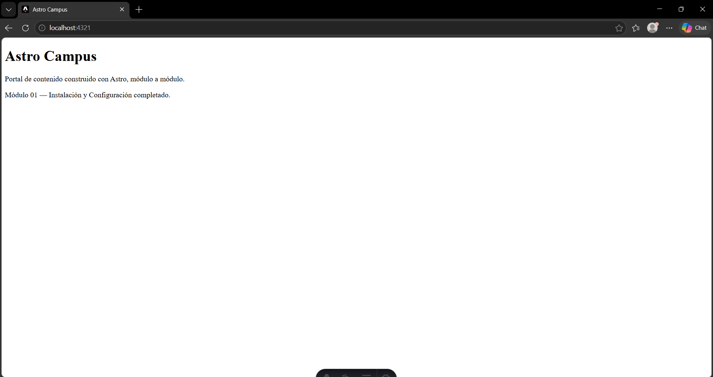
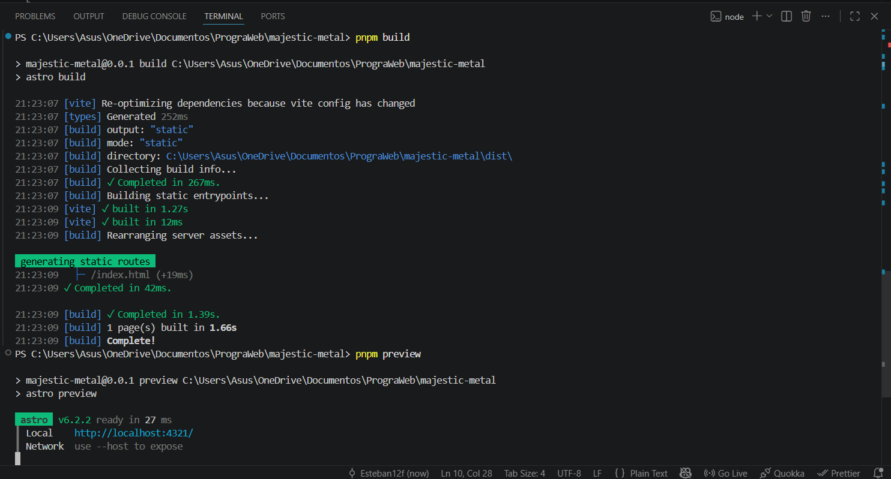
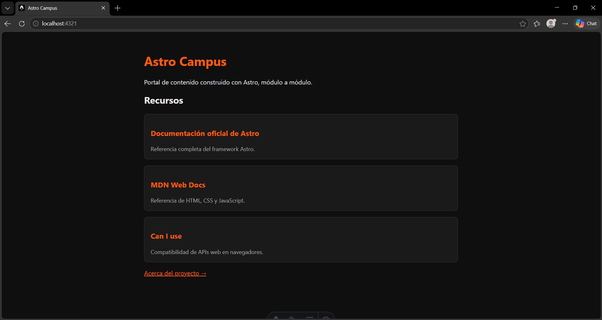
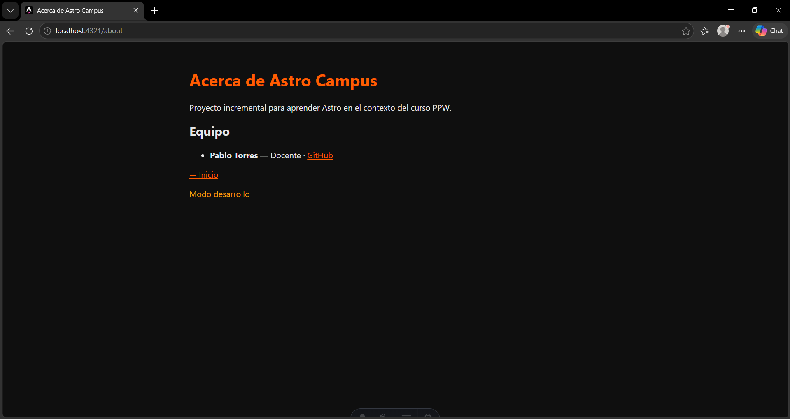

# Astro Campus

## Descripción del Proyecto

Se desarrolló una aplicación base utilizando **Astro**, con el objetivo de establecer un entorno de desarrollo moderno, eficiente y preparado para la construcción incremental de un portal de contenido denominado **Astro Campus**.

Este proyecto servirá como base para los siguientes módulos, donde se integrarán nuevas funcionalidades sin alterar la estructura inicial.

---

## Objetivos

- Configurar correctamente el entorno de desarrollo con Astro
- Crear un proyecto base funcional utilizando el CLI oficial
- Comprender la estructura inicial del framework
- Verificar la ejecución en modo desarrollo y producción

---

## Estructura del Proyecto

```bash
astro-campus/
├── public/
│   └── favicon.svg
├── src/
│   └── pages/
│       └── index.astro
├── astro.config.mjs
├── package.json
├── tsconfig.json
└── pnpm-lock.yaml
```

La carpeta `src/pages/` define las rutas del sitio. Cada archivo `.astro` representa una página accesible desde el navegador.

---

## Tecnologías Utilizadas

- Astro
- TypeScript
- Node.js
- PNPM

---

## Instalación y Ejecución

### Requisitos previos

- Node.js versión 18 o superior
- PNPM instalado globalmente
- Editor de código (recomendado: Visual Studio Code)

---

### Pasos para ejecutar el proyecto

```bash
pnpm install
pnpm dev
```

Abrir en el navegador:

```
http://localhost:4321
```

---

## Configuración del Proyecto

Archivo: `astro.config.mjs`

```js
import { defineConfig } from 'astro/config';

export default defineConfig({
  output: 'static',
  site: 'https://astro-campus.example.com',
});
```

El proyecto se configura como **sitio estático**, lo que mejora el rendimiento y facilita el despliegue.

---

## Página Inicial

Archivo: `src/pages/index.astro`

La página principal muestra:

- Título dinámico: **Astro Campus**
- Descripción del proyecto
- Confirmación del módulo completado

---

# Build de Producción

Para generar la versión final del sitio:

```bash
pnpm build
pnpm preview
```

El contenido generado se encuentra en la carpeta `dist/`.

---

## Evidencias

### 1. Creación del proyecto

<p align="center">
  
</p>

---

### 2. Información del entorno Astro

<p align="center">
  
</p>

---

### 3. Sitio en ejecución (localhost)

<p align="center">
  
</p>

---

### 4. Build de producción

<p align="center">
  
</p>

---

## Validaciones Realizadas

- Node.js correctamente instalado (versión ≥ 18)
- PNPM funcionando correctamente
- Proyecto creado con estructura mínima
- `pnpm astro info` muestra configuración correcta
- Servidor de desarrollo ejecutándose sin errores
- Página accesible en `localhost:4321`
- Build de producción generado correctamente
- Vista previa del build funcionando

---

## Conclusión

Se logró configurar exitosamente el entorno de desarrollo con Astro, estableciendo una base sólida para la construcción de aplicaciones web modernas.

El proyecto inicial permite comprender la estructura del framework y garantiza un punto de partida estable para los siguientes módulos del curso.

---

# Práctica 02: Fundamentos de Astro

## Descripción

En esta práctica se amplió el proyecto mediante la creación de componentes reutilizables y nuevas páginas, aplicando conceptos fundamentales de Astro como **props, frontmatter y renderizado dinámico**.

---

## Objetivos

- Crear componentes reutilizables
- Utilizar props tipados
- Implementar múltiples páginas
- Aplicar renderizado dinámico y condicional

---

## Archivos añadidos

```bash
src/
 ├── components/
 │   └── RecursoCard.astro
 └── pages/
     ├── index.astro
     └── about.astro
```

---

## Funcionalidades Implementadas

### Componente RecursoCard

- Recibe props: `titulo`, `url`, `descripcion`
- Encapsula estilos propios

---

### Página principal (index)

- Lista de recursos renderizada dinámicamente
- Uso de `.map()`
- Integración de componente reutilizable

---

### Página About

- Nueva ruta `/about`
- Información del proyecto
- Lista del equipo
- Navegación entre páginas

---

### Renderizado condicional

- Uso de `&&` para mostrar contenido
- Detección de entorno (desarrollo / producción)

---

## Resultado Esperado

### `/`

- Lista de recursos en formato cards
- Navegación a `/about`

### `/about`

- Información del proyecto
- Lista del equipo
- Mensaje dinámico según entorno

---

## Evidencias

### Página principal con cards

<p align="center">
  
</p>

### Página About

<p align="center">
  
</p>

---

## Validaciones

- Componente reutilizable funcionando
- Props tipados correctamente
- Página `/about` accesible
- Renderizado dinámico correcto
- `pnpm astro check` sin errores

---

## Conclusión

Se logró implementar correctamente los fundamentos de Astro, destacando la creación de componentes reutilizables y el uso de renderizado dinámico. El proyecto continúa evolucionando de forma estructurada, manteniendo una base sólida para futuras prácticas.
